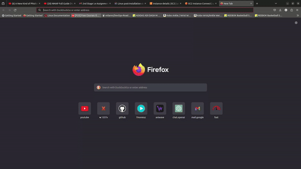

### Error Encountered

Permission dneied while trying to connect to the docker socket. i also had previously encountered this issue and was able to solve it by adding the current user to the docker group.
```bash
sudo usermod -aG docker $USER
```

However while trying the same with the cloud-inti it was not happening. since cloud-init suns as root by default it could be taking root as the value when i mention `$USER` while i append the docker group.

The site with and without the `nip.io` dns :

